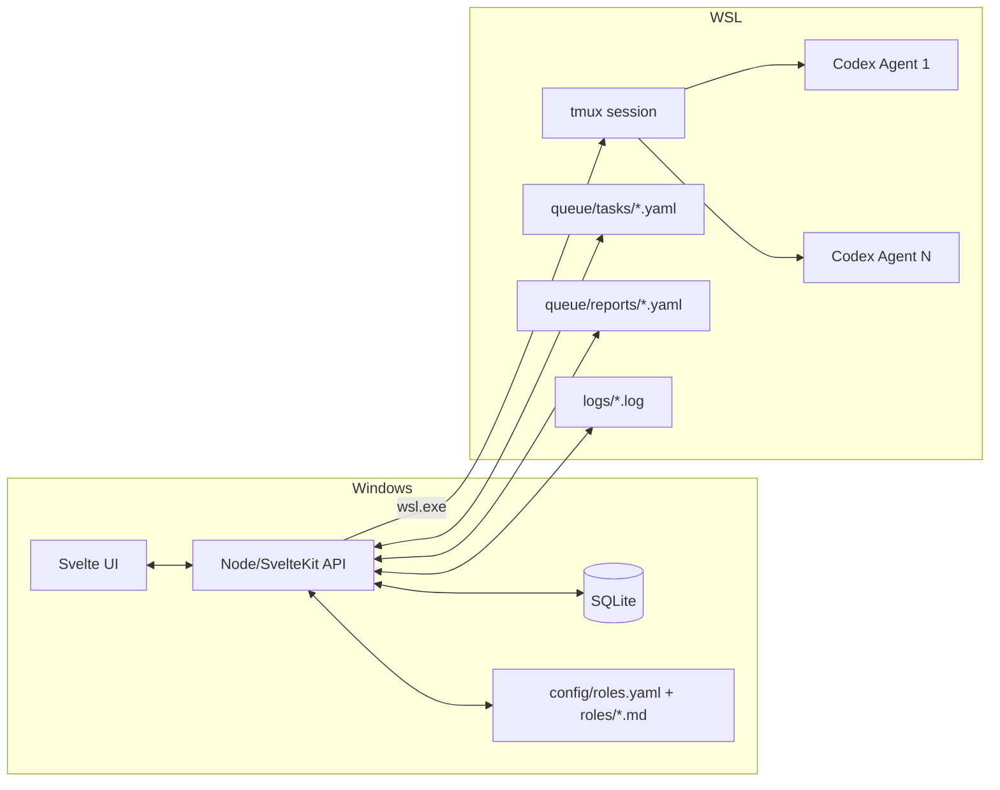

# Codex向けマルチエージェント基盤 設計（WSL + tmux + Svelte）

## 目的
- Windows（PowerShell）から操作可能なマルチエージェント基盤を構築する
- Codex CLI（`codex`）を複数起動し、役割ごとに並列実行できる
- 役割定義を `config/roles.yaml` + 役割ファイルでユーザーが自由に追加/編集できる
- ローカル Web UI（Svelte）で「役割管理・起動/停止・タスク投入・ログ/進捗/履歴」を提供する
- データは SQLite に永続化する

## 非目的
- Windows Terminal のタブ/ペイン自動生成（対象外）
- Codex CLI の拡張オプション依存（`codex` コマンドのみ前提）
- クラウド配布やマルチユーザー運用

## 全体アーキテクチャ


## コンポーネント

### 1) Web UI（Svelte）
- 役割管理（作成/編集/削除/有効化）
- 起動/停止（tmux セッション操作）
- タスク投入（役割単位に割り当て）
- 進捗表示（タスク/役割の状態、最新ログ）
- 履歴表示（過去タスク、実行ログ）

### 2) API/オーケストレーター（SvelteKit サーバー）
- `wsl.exe` 経由で tmux/WSL コマンドを実行
- 役割設定の読込・検証・永続化
- タスク作成、キュー生成、進捗/履歴管理
- SQLite への保存

### 3) 実行基盤（WSL + tmux）
- tmux セッションに役割ごとのエージェントを配置
- `codex` を各エージェントとして起動
- タスクは `queue/tasks/<role>.yaml` に書き込み、tmux send-keys で通知

## ディレクトリ構成（新規）
```
MonochromeMemory.CodexMultiAgent/
├─ app/                    # SvelteKit (UI + API)
├─ config/
│  ├─ settings.yaml         # WSL/tmux/DB/UI 設定
│  └─ roles.yaml            # 役割一覧
├─ roles/                   # 役割ファイル（Markdown）
├─ runtime/
│  ├─ queue/
│  │  ├─ tasks/             # 役割別タスク（YAML）
│  │  └─ reports/           # 役割別レポート（YAML）
│  └─ logs/                 # 役割別ログ
├─ scripts/
│  ├─ start.ps1             # PowerShell 起動スクリプト
│  └─ wsl.sh                # WSL 内ユーティリティ
└─ README.md
```

## 役割定義
### roles.yaml（例）
```yaml
roles:
  - id: shogun
    name: "将軍"
    prompt_path: "roles/shogun.md"
    enabled: true
  - id: ashigaru1
    name: "足軽1"
    prompt_path: "roles/ashigaru1.md"
    enabled: true
```

### 役割ファイル
- Markdown 形式
- 役割の目的・禁止事項・作業手順・報告フォーマットなどを記述

## SQLite スキーマ（最小構成）
```sql
-- 役割
CREATE TABLE roles (
  id TEXT PRIMARY KEY,
  name TEXT NOT NULL,
  prompt_path TEXT NOT NULL,
  enabled INTEGER NOT NULL DEFAULT 1,
  created_at TEXT NOT NULL,
  updated_at TEXT NOT NULL
);

-- 実行セッション
CREATE TABLE runs (
  id TEXT PRIMARY KEY,
  started_at TEXT NOT NULL,
  ended_at TEXT,
  status TEXT NOT NULL
);

-- タスク
CREATE TABLE tasks (
  id TEXT PRIMARY KEY,
  run_id TEXT NOT NULL,
  role_id TEXT NOT NULL,
  title TEXT NOT NULL,
  body TEXT NOT NULL,
  status TEXT NOT NULL,
  created_at TEXT NOT NULL,
  updated_at TEXT NOT NULL,
  FOREIGN KEY(run_id) REFERENCES runs(id),
  FOREIGN KEY(role_id) REFERENCES roles(id)
);

-- ログ（メタ情報）
CREATE TABLE logs (
  id TEXT PRIMARY KEY,
  run_id TEXT NOT NULL,
  role_id TEXT NOT NULL,
  path TEXT NOT NULL,
  created_at TEXT NOT NULL,
  FOREIGN KEY(run_id) REFERENCES runs(id),
  FOREIGN KEY(role_id) REFERENCES roles(id)
);
```

## 主要フロー

### 1) 起動
1. PowerShell から `scripts/start.ps1` を実行
2. API サーバー起動（SvelteKit）
3. `wsl.exe` 経由で tmux セッション作成
4. 役割数に応じて tmux ウィンドウを作成し `codex` を起動
5. 各ウィンドウに役割指示書を読み込むよう send-keys

### 2) タスク投入
1. UI で役割とタスク内容を選択
2. API が SQLite に保存
3. `runtime/queue/tasks/<role>.yaml` を生成
4. tmux send-keys で「タスクファイルを読め」と通知

### 3) 進捗・ログ表示
- `runtime/logs/*.log` を UI から参照
- 必要に応じて `queue/reports/*.yaml` を読み込んで状態を更新

## 設定ファイル（settings.yaml 例）
```yaml
wsl:
  distro: "Ubuntu"
  root_path: "/home/<user>/codex-multi-agent"

tmux:
  session: "codex-agents"

codex:
  command: "codex"

ui:
  host: "localhost"
  port: 5173

data:
  sqlite_path: "data/app.db"
```

## 仕様上の制約
- Windows Terminal 連携は対象外
- `codex` の起動オプションは固定せず、プロンプト指示で役割を浸透させる
- WSL + tmux を前提とするため、導入手順は README で明示する
